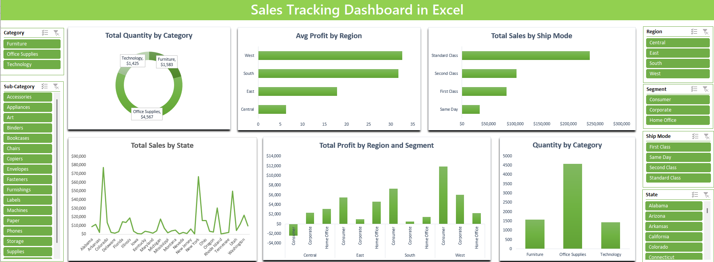

# 📊 Sales Tracking Dashboard in Excel

## Overview
This Sales Tracking Dashboard is built in **Microsoft Excel** and provides an interactive way to monitor sales performance across multiple dimensions, such as:

- Category
- Region
- Segment
- Ship Mode
- State

The dashboard helps users analyze key metrics including **Total Sales**, **Profit**, and **Quantity Sold** through dynamic visuals and slicers.

---

## 📁 File Contents
- Excel file that includes:
  - Pivot Tables
  - Interactive Slicers
  - Dynamic Charts
  - Clean and user-friendly layout

---

## 📈 Key Visuals

### ✅ Total Quantity by Category
- Donut chart displaying quantity sold by:
  - Furniture
  - Office Supplies
  - Technology

### ✅ Avg Profit by Region
- Horizontal bar chart showing average profit per region:
  - West
  - South
  - East
  - Central

### ✅ Total Sales by Ship Mode
- Bar chart comparing total sales by shipping method:
  - Standard Class
  - Second Class
  - First Class
  - Same Day

### ✅ Total Sales by State
- Line chart showing sales distribution across U.S. states.

### ✅ Total Profit by Region and Segment
- Vertical bar chart showing profit breakdown by:
  - Region (Central, East, South, West)
  - Segment (Consumer, Corporate, Home Office)

### ✅ Quantity by Category
- Bar chart displaying item quantity sold by each major category.

---

## 🎚️ Filters / Slicers
The dashboard includes slicers to filter all visuals by:
- **Category**
- **Sub-Category**
- **Region**
- **Segment**
- **Ship Mode**
- **State**

All slicers are connected to relevant Pivot Tables and charts.
